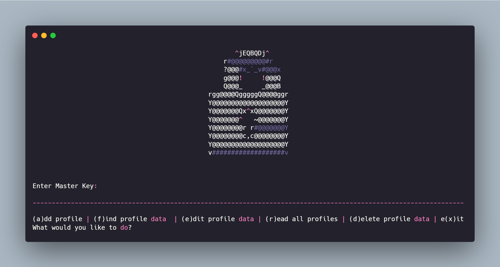
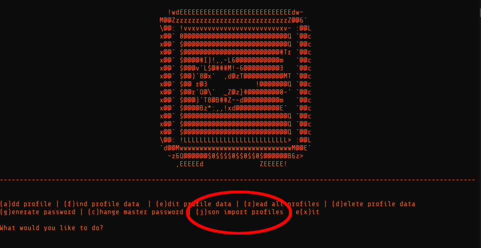
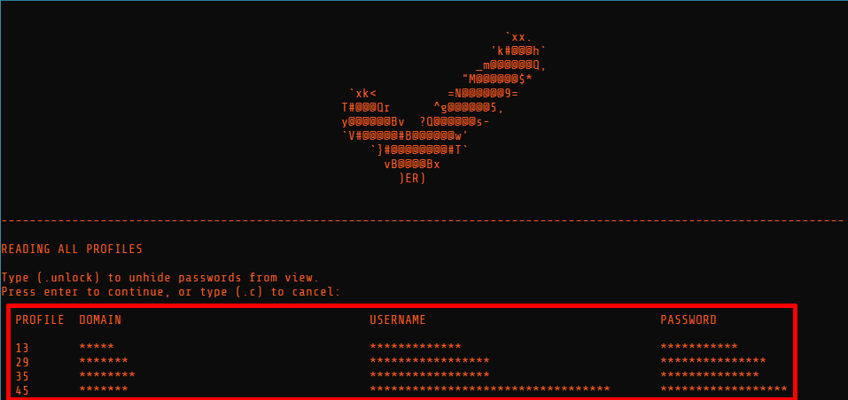
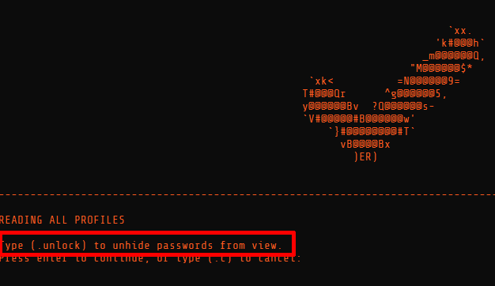

# Password Manager
This project was originally forked from [MarkMcKinney/DIY-Password-Manager](https://github.com/MarkMcKinney/DIY-Password-Manager).
I added a few features for my own person convenience.

## Fork Additions:
- **Changed menu icon(s).**
- **Included `.bat` file for desktop shortcut (`.exe` as a later feature).**
- **Import profiles/credentials in bulk via any `.json` file** *(Note: `test_add_to_db.json` is included with the source, and can be used as a template)*.
- **Display Table of all available profiles/passwords with each context menu items:** 
- **Hide/Show Display Table to protect sensitive profile and credential information:** 

## Disclaimer!
This was built for educational purposes. This Password Manager is used at your own risk. This software is provided as is and I (including any contributors) do not take any responsibility for any damage or loss done with or by it.
